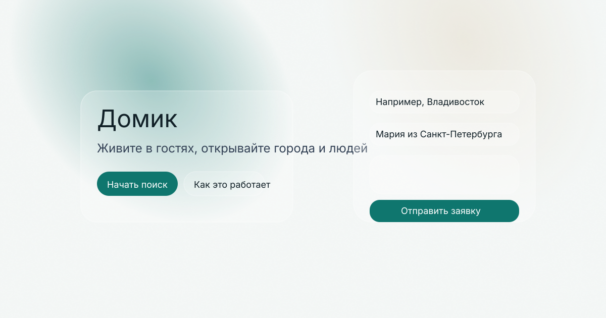

# Домик — стеклянная дизайн-система

> Домик строится на Tailwind + shadcn/ui компонентах и расширен стеклянными слоями. Эта заметка помогает дизайнерам и разработчикам применять тему.

## Токены

| Переменная | Назначение | Светлая тема | Тёмная тема |
| --- | --- | --- | --- |
| `--bg` | Базовый фон | `244 247 246` | `13 18 23` |
| `--fg` | Основной текст | `17 24 39` | `229 235 239` |
| `--muted` | Вторичный текст | `87 103 120` | `148 163 184` |
| `--primary` | CTA и акценты | `15 118 110` | `45 212 191` |
| `--accent` | Тёплые пятна и подсветка | `231 224 209` | `188 180 160` |
| `--border` | Границы | `200 208 214` | `64 72 84` |
| `--ring` | Фокус и hover | `15 118 110` | `45 212 191` |

## Стеклянные классы

- `.glass` — основная поверхность: `bg-white/10`, `backdrop-blur`, `border-white/15`, `ring-white/10`, `rounded-2xl`, `shadow-md`.
- `.glass-strong` — усиленный слой для карточек и модалок.
- `.glass-card` — готовый вариант для shadcn/ui Card.

На мобильных ширинах (`<640px`) применяется `backdrop-blur-md`, на `md` и выше — `backdrop-blur-lg/xl`. Если `backdrop-filter` не поддерживается, фон автоматически становится менее прозрачным.

## Компоненты

- **Кнопки** — `solid` для основных CTA, `ghost` для второстепенных, `glass` внутри стеклянных секций.
- **Card/Dialog/Popover** — наследуют стеклянные утилиты, поэтому размещайте текст с коэффициентом контраста ≥ 4.5.
- **Inputs** — класс `input-base` добавляет стеклянный фон и заметный focus ring.

## Пример

Градиентный фон и шум находятся в `styles/globals.css`, их можно переиспользовать в других проектах Домика.
